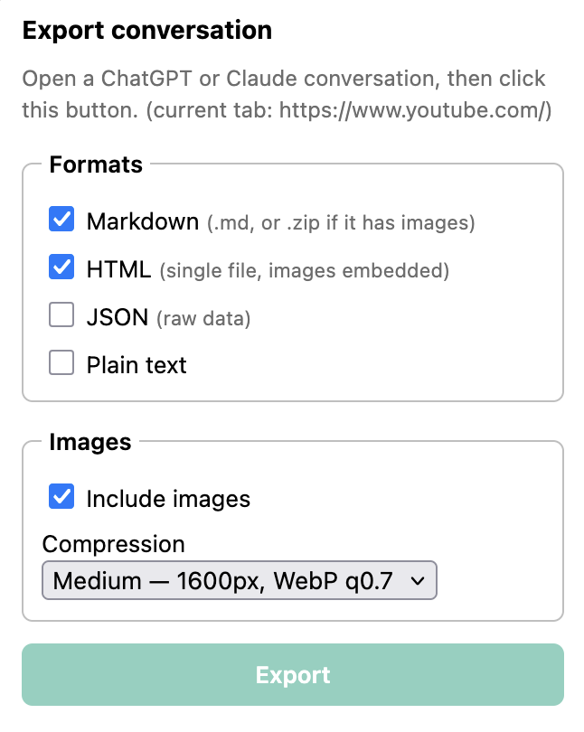

# ChatGPT & Claude Conversation Exporter

Export the ChatGPT or Claude conversation you're viewing to **Markdown**, **HTML**,
**JSON**, or **plain text** — with images included. Works in Firefox (and Zen) and
Chrome/Chromium browsers.



**[Download the latest release](https://github.com/p-munhoz/chatgpt-claude-exporter/releases/latest)**

## Features

- **4 export formats**: Markdown (plain `.md`, or a `.zip` with an `images/` folder if
  the conversation has images), self-contained HTML (images embedded as data URIs),
  raw JSON, plain text.
- **Images included**, downloaded straight from the API — toggle them off, or shrink
  them with adjustable WebP compression (Off / Light / Medium / Strong).
- **Filenames from the real conversation title** (`chatgpt-my-conversation-2026-08-30.md`),
  accents and all.
- **Survives closing the popup** — export runs on the page itself, not in the popup.
- **Remembers your last-used settings**.
- **Nothing leaves your machine.** All requests are first-party calls to the site
  you're already on, using your existing session — no external server, no telemetry.

## Install

### Firefox / Zen (permanent — recommended)

1. Download the `.xpi` from [Releases](https://github.com/p-munhoz/chatgpt-claude-exporter/releases/latest).
2. Drag it into a Firefox/Zen window (or open it directly). Confirm the install prompt.

It's signed by Mozilla, so no Developer mode or `about:config` changes needed, and it
survives restarting the browser.

### Chrome / Edge / Brave

1. Download and unzip the Chrome `.zip` from [Releases](https://github.com/p-munhoz/chatgpt-claude-exporter/releases/latest).
2. `chrome://extensions` → enable **Developer mode**.
3. **Load unpacked** → select the unzipped folder.

Chrome keeps unpacked extensions installed across restarts as long as Developer mode
stays on and the folder isn't moved or deleted — there's no separate "permanent" step.
A Chrome Web Store listing (no Developer mode needed) would need a one-time $5 Google
developer fee and their review process.

### Firefox / Zen (temporary, for development)

1. `about:debugging#/runtime/this-firefox` → **Load Temporary Add-on…**
2. Pick `manifest.json` in the repo root (or `dist/firefox/manifest.json`).

After editing code in either browser: reload the extension **and** hard-reload the
ChatGPT/Claude tab (reloading the extension alone does not re-inject content scripts
into tabs that are already open).

## Usage

1. Open a saved conversation on chatgpt.com or claude.ai.
2. Click the extension icon.
3. Pick formats and image options, hit **Export**.
4. Files land in your default downloads folder. Safe to close the popup right away —
   you'll get an in-page toast when it's done.

## How it works

- `src/content-main.js` runs in the **page's own JS world** (`world: "MAIN"`), so its
  `fetch()` calls carry your real session. It reads the site's internal API:
  - ChatGPT: `/api/auth/session` → bearer token, then `/backend-api/conversation/<id>`;
    images via `/backend-api/files/<id>/download`.
  - Claude: `/api/organizations`, then
    `/api/organizations/<org>/chat_conversations/<id>?tree=True&rendering_mode=messages`;
    images via each file's `preview_url`.
  - Image compression (downscale + WebP re-encode) also happens here, via `OffscreenCanvas`.
- `src/content-export.js` runs in the isolated content-script world with JSZip, marked
  and `formatters.js` bundled. It asks the MAIN world for the conversation, builds the
  chosen files, and saves them with an `<a download>` click. Because it lives in the
  page, **the export keeps running after you close the popup**.
- `popup.js` just collects options, tells the content script to start, and shows live
  progress while it's open.

No background script, no `downloads` permission.

Bundles [JSZip](https://github.com/Stuk/jszip) and [marked](https://github.com/markedjs/marked) (both MIT).

## Build & package

```
node tools/gen-icons.mjs   # one-time: regenerate PNG icons (already committed)
node build.mjs             # -> dist/firefox/ and dist/chrome/
```

`dist/firefox/` and `dist/chrome/` are identical except for the manifest (the Chrome
one drops the Gecko block and sets `minimum_chrome_version`).

```
npx web-ext build --source-dir=dist/firefox --artifacts-dir=dist   # Firefox .zip
cd dist/chrome && zip -r ../chrome.zip .                            # Chrome .zip
```

Permanent Firefox/Zen install needs a signed `.xpi`:

```
npx web-ext sign --source-dir=dist/firefox --channel=unlisted --api-key=... --api-secret=...
```

## Known limits / notes

- These are private, unversioned APIs; field names occasionally change. The parsers
  in `src/content-main.js` are defensive but may need a tweak. The popup and the page
  console (`[exporter]` lines) show the thrown error.
- Only the currently open conversation is exported (no bulk export). It must be a saved
  conversation — the URL needs `/c/<id>` (ChatGPT) or `/chat/<id>` (Claude).
- ChatGPT `tool`/`system` messages and Claude `thinking` blocks are skipped.
- Text attachments (uploaded PDFs/CSVs on Claude) are included as their extracted text,
  not the original binary.
- *Include images* off leaves an `_[image not exported]_` marker; compression
  re-encodes already-lossy JPEGs, so use "Off" if you need pixel-accurate originals.
  The page console logs each image, e.g.
  `image/jpeg 249KB @1152x1536 -> image/webp 61KB @1200x1600`.
- Downloads go straight to your default download folder (no save dialog).
